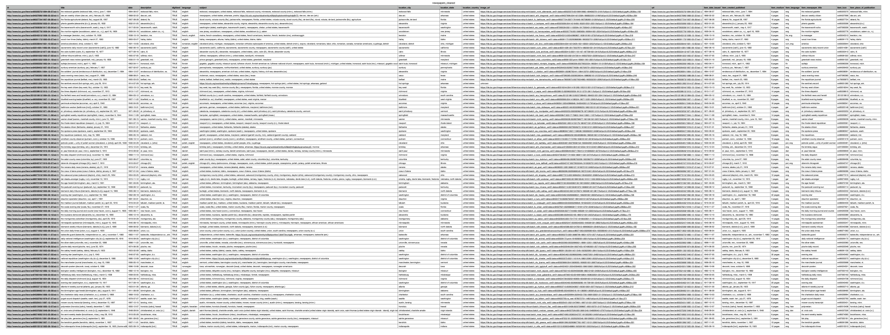
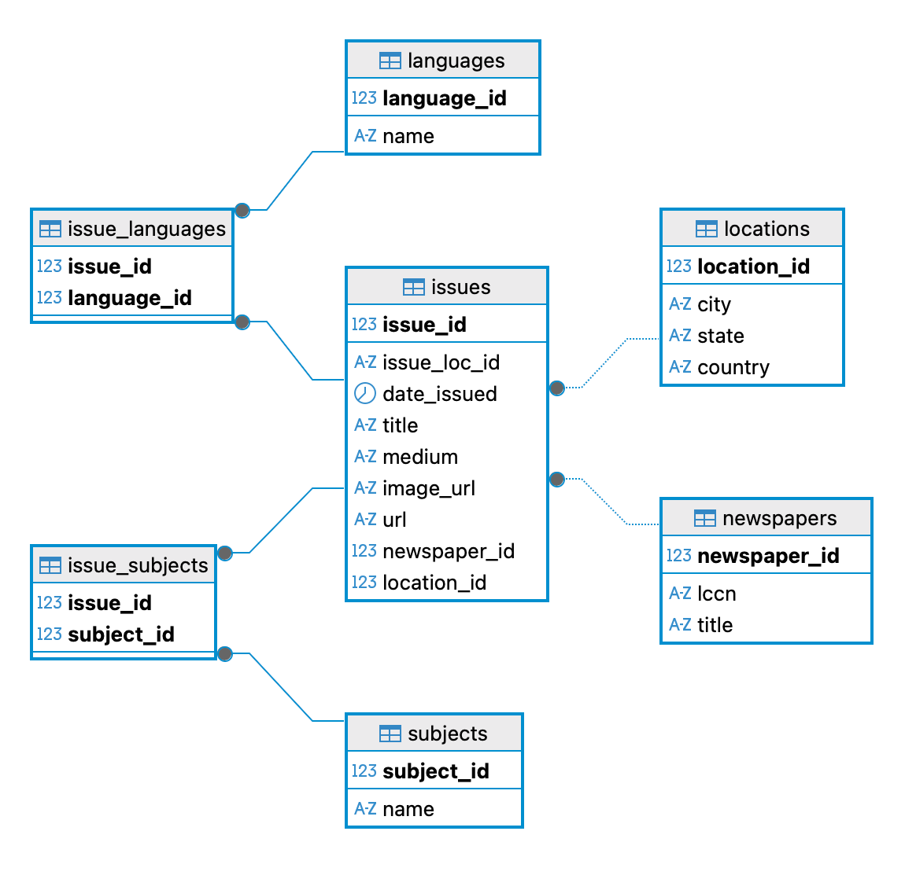
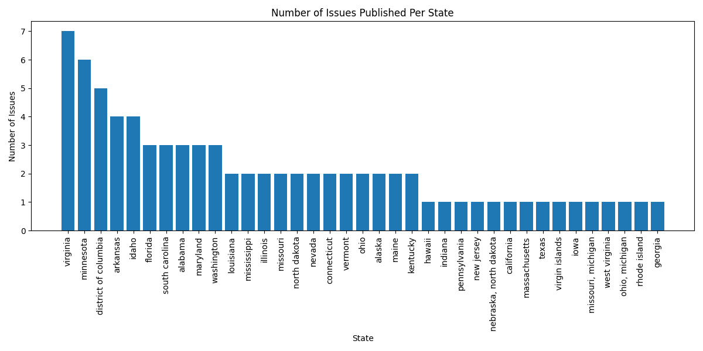
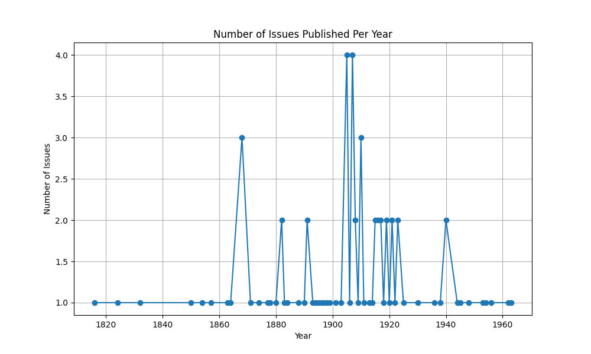
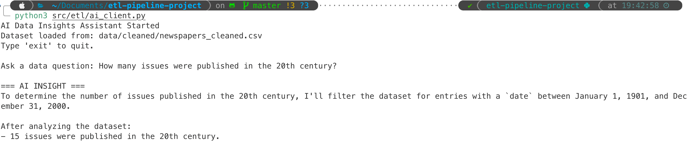
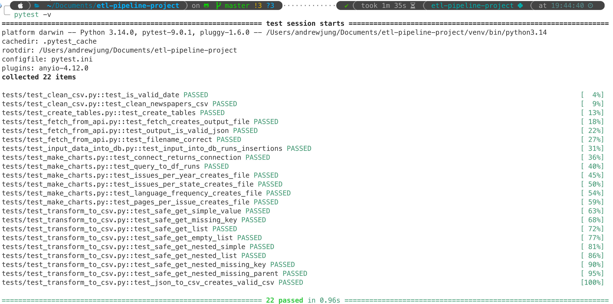
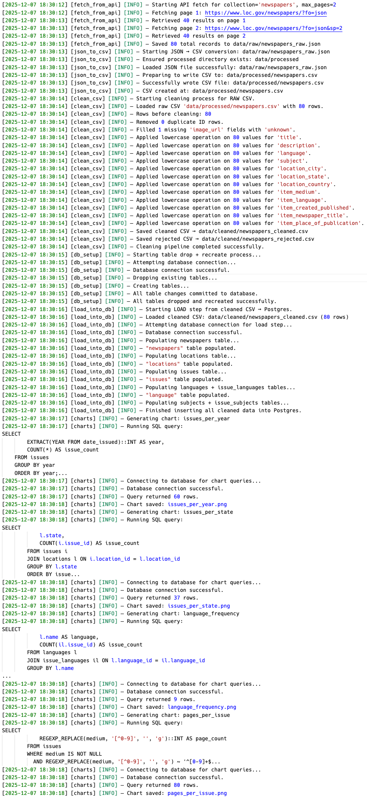

<!-- Languages -->


<!-- Frameworks / Libraries -->


# Overview

This project implements a fully automated ETL pipeline that ingests historical newspaper data from the Library of Congress Newspaper API, cleans and validates the dataset, loads it into a normalized PostgreSQL database, and generates analytical charts.
It also integrates Google Gemini for AI-powered insights on the cleaned data, enabling natural-language exploration of the dataset.

This project simulates a production-grade data engineering workflow, with logging, testing, modular architecture, and structured pipelines.

# Project Structure
```
etl-pipeline-project/
│
├── data/
│   ├── raw/                         # Raw API JSON responses
│   ├── processed/                   # CSV created from JSON
│   └── cleaned/                     # Cleaned + rejected CSV outputs
│
├── images/                          # Auto-generated analytic charts
│
├── logs/
│   └── etl_pipeline.log             # Rotating log file for all ETL stages
│
├── src/
│   └── etl/
│        ├── fetch_from_api.py       # Extract raw JSON from LOC API
│        ├── transform_to_csv.py     # Transform JSON → CSV
│        ├── clean_csv.py            # Validate + standardize data
│        ├── create_tables.py        # PostgreSQL schema creation
│        ├── input_data_into_db.py   # Load cleaned data into DB
│        ├── make_charts.py          # Generate visual analytics
│        ├── ai_client.py            # Gemini-powered dataset insights
│        ├── logger.py               # Centralized rotating log handler
│        └── run_pipeline.py         # One-click full ETL orchestration
│
├── tests/                           # Pytest suite for every ETL stage
│
└── README.md
```

# ETL Workflow

## 1. Extract

- Connects to the Library of Congress (LOC) Newspapers API
- Handles pagination automatically
- Logs network failures, retries, and request progress
- Saves the combined results as:
    - data/raw/newspapers_raw.json
- 

## 2. Transform

- Converts raw API JSON into a structured CSV file
    - data/processed/newspapers.csv
- Normalizes nested fields
- Extracts text lists, cleans URLs, merges columns
- Data Cleaning & Validation
- Performed in clean_csv.py:
    - Removes duplicate records
    - Rejects rows with missing critical fields
    - Rejects invalid or unparseable dates
    - Rejects incomplete location information
    - Lowercases text fields for normalization
    - Fills non-critical missing fields with "unknown"
- Produces two final files:
    - data/cleaned/newspapers_cleaned.csv
    - data/cleaned/newspapers_rejected.csv
## 3. Load (PostgreSQL)

- A fully normalized schema is created:
    - newspapers
    - locations
    - issues
    - languages
    - subjects
    - issue_languages (junction)
    - issue_subjects (junction)
- Cleaned data is inserted using input_data_into_db.py.
    - 


## 4. Analyze (Charts)

- make_charts.py automatically generates (saved in /images):
    - Issues Per Year
    - Issues Per State
    - Language Frequency
    - Page Count Distribution
    - Examples:
        - 
        - 

## 5. AI Insights (Google Gemini)
- ai_client.py enables:
    - Loading cleaned CSV data
    - Analysis using Gemini
    - 
# Testing
- The project includes Pytest test cases for:
    - Database connection
    - Table creation
    - Data loading
    - Chart generation
    - Transform functions
    - API fetching
    - 
# Logging
- When the pipeline is run, logs are stores in /logs
- 

